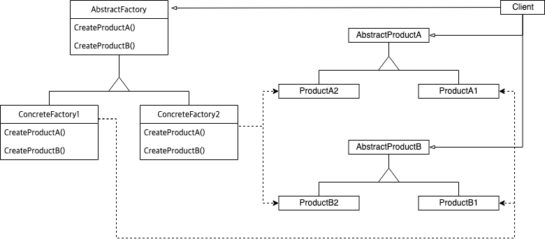
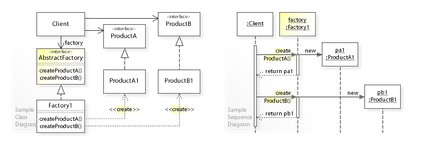

:root_dir: ../../
:parent_dir: ../
:src_dir: ../src/net/razy/design/patterns/creational/abstract_factory
include::{root_dir}/adocs/_toc.adoc[]

= Abstract Factory Pattern

== Descriptions
*서로 관련성이 있는 다양한 객체(재료)를 생성하기 위한 인터페이스를 제공한다*

서로 관련이 있는 객체들(재료)을 그룹화 하여 팩토리 클래스로 만들고,
조건에 따라 팩토리를 선택(생성)하여 최종 완성품을 생성하는 패턴

cf> xref:factory_method.adoc[Factory Method Pattern]::
* 조건에 따른 객체 생성을 팩토리 클래스(의 method)로 위임하여, 팩토리 클래스에서 객체를 생성하는 패턴.

== UML

== Sample Code
=== Abstract Classes
두 가지 제품(재료) 군
[source,java]
.AbstractProductA
----
include::{src_dir}/AbstractProductA.java[]
----

[source,java]
.AbstractProductB
----
include::{src_dir}/AbstractProductB.java[]
----

[source,java]
.AbstractFactory
----
include::{src_dir}/AbstractFactory.java[]
----
AbstractProductA, AbstractProductB 두 가지 타입의 제품(재료)군을 생성하는 Factory 의 추상 클래스/interface

=== Concrete Classes
[source,java]
.ConcreteFactory01
----
include::{src_dir}/ConcreteFactory01.java[]
----

[source,java]
.ConcreteFactory01
----
include::{src_dir}/ConcreteFactory01.java[]
----

[source,java]
.ConcreteFactory01
----
include::{src_dir}/ConcreteFactory01.java[]
----

[source,java]
.ConcreteFactory01
----
include::{src_dir}/ConcreteFactory01.java[]
----