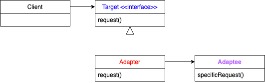

:root_dir: ../../
:docs_dir: ./
:src_dir: ../src/net/razy/design/patterns/structural/adapter
include::{root_dir}/adocs/_toc.adoc[]

= Adapter Pattern

== Descriptions
클래스의 인터페이스를 사용자가 기대하는 인터페이스 형태로 적응(변환) 시킵니다.
서로 일치하지 않는 인터페이스를 갖는 클래스들을 함께 동작시킵니다.

include::{root_dir}/adocs/_to_index.adoc[]

== UML

include::{root_dir}/adocs/_to_index.adoc[]

== Code Examples
=== Abstract/Interface Classes
==== Target
.Target
[source,java]
----
include::{src_dir}/ITarget.java[]
----

=== Concrete Classes
==== Adaptee A
.AdapteeA
[source,java]
----
include::{src_dir}/AdapteeA.java[]
----

==== Adapter A
AdapteeA 에 대한 Adapter

.AdapterA
[source,java]
----
include::{src_dir}/AdapterA.java[]
----

==== Adaptee B
.AdapteeB
[source,java]
----
include::{src_dir}/AdapteeB.java[]
----

==== Adapter B
AdapteeB 에 대한 Adapter

.AdapterB
[source,java]
----
include::{src_dir}/AdapterB.java[]
----

=== Client
.Client
[source,java]
----
include::{src_dir}/Client.java[]
----

=== Results
----
It's a specific request within the Adaptee A
It's a specific request within the Adaptee B
----

include::{root_dir}/adocs/_to_index.adoc[]