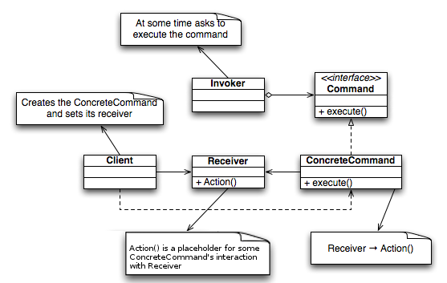

:root_path: ../../..
:docs_path: ..
:src_path: ../../src/net/razy/design/patterns/behavioral/command
include::{root_path}/adocs/_toc.adoc[]

= Command Pattern

== Descriptions
GOF::
* 요청 자체를 캡슐화하는 것입니다.
* 이를 통해 요청이 서로 다른 사용자를 매개변수로 만들고, 요청을 대기시키거나 로깅하며, 되돌릴 수 있는 연산을 지원합니다.

HeadFirst::
* 요구 사항을 객체로 캡슐화할 수 있으며, 매개변수를 써서 여러 가지 다른 요구 사항을 집어넣을 수도 있습니다.
* 또한 요청 내역을 큐에 저장하거나 로그로 기록할 수도 있으며, 작업취소 기능도 지원 가능합니다.
* 실행될 기능의 변경에도 호출자 클래스를 수정 없이 그대로 사용 할 수 있도록 해준다.

include::{root_path}/adocs/_to_index.adoc[]

== UML

include::{root_path}/adocs/_to_index.adoc[]

== Code Examples
=== Command
.Command
[source,java]
----
include::{src_path}/Command.java[]
----

.AbstractCommand
[source,java]
----
include::{src_path}/AbstractCommand.java[]
----

.TurnOnCommander
[source,java]
----
include::{src_path}/TurnOnCommander.java[]
----

.TurnOffCommander
[source,java]
----
include::{src_path}/TurnOffCommander.java[]
----

=== Invoker
.Invoker
[source,java]
----
include::{src_path}/Invoker.java[]
----

=== Client
.Client
[source,java]
----
include::{src_path}/Client.java[]
----

=== Results
----
Invoker Do Something and Execute command
- TurnOnCommander Do something and call receiver on
	- Receiver On

Invoker Do Something and Execute command
- TurnOffCommander Do something and call receiver off
	- Receiver Off
----

include::{root_path}/adocs/_to_index.adoc[]