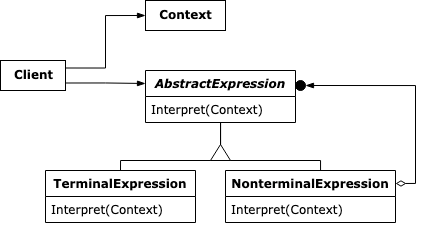

:root_path: ../../..
:docs_path: ..
:src_path: ../../src/net/razy/design/patterns/behavioral/interpreter
include::{root_path}/adocs/_toc.adoc[]

= Interpreter Pattern

== Descriptions

문법을 해석할 수 있는 객체를 조합하여 구문을 특정한 문법으로 해석할 수 있도록 합니다.

include::{root_path}/adocs/_to_index.adoc[]

== UML

include::{root_path}/adocs/_to_index.adoc[]

== Code Examples

=== Client
ToDo

=== Results
----
ToDo
----

include::{root_path}/adocs/_to_index.adoc[]