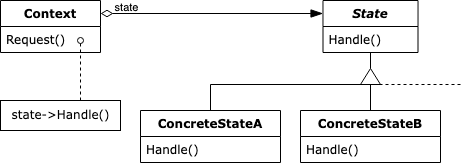

:root_path: ../../..
:docs_path: ..
:src_path: ../../src/net/razy/design/patterns/behavioral/state
include::{root_path}/adocs/_toc.adoc[]

= State Pattern

== Descriptions
객체의 내부 상태에 따라 스스로 행동을 변경할 수 있게 하는 패턴. +
이렇게 하면 객체는 마치 자신의 클래스를 바꾸는 것처럼 보입니다.

* state 패턴을 구현한다는 것은 각 상태에 대응하는 별도의 클래스를 만들고 상태 전이 로직을 그 클래스들로 옮기는 작업을 뜻한다.
* 이 때 원래의 호스트 객체를 *Design Patterns* 에서는 *컨텍스트(context)* 라 부르는데, 컨텍스트 객체는 상태와 관련된 기능을 스테이트 객체에 위임한다.
* 그리고 상태 전이는 컨텍스트 객체의 대리 객체를 한 스테이트 객체에서 다른 스테이트 객체로 바꾸는 일이 된다.

include::{root_path}/adocs/_to_index.adoc[]

== UML

image::state-02.jpeg[align=center]

include::{root_path}/adocs/_to_index.adoc[]

== Code Examples

=== Context
.Context
[source,java]
----
include::{src_path}/Context.java[]
----

=== States
.State
[source,java]
----
include::{src_path}/State.java[]
----

.OnState
[source,java]
----
include::{src_path}/OnState.java[]
----

.OffState
[source,java]
----
include::{src_path}/OffState.java[]
----

=== Client
.Client
[source,java]
----
include::{src_path}/Client.java[]
----

=== Results
----
Turn On
It's already on
Turn Off
It's already off
----

include::{root_path}/adocs/_to_index.adoc[]
