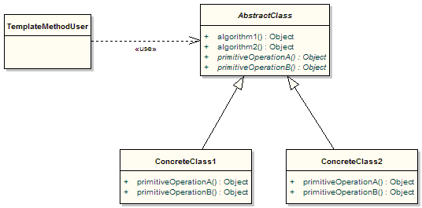

:root_path: ../../..
:docs_path: ..
:src_path: ../../src/net/razy/design/patterns/behavioral/template_method
include::{root_path}/adocs/_toc.adoc[]

= Template Method Pattern

== Descriptions
동작 상의 알고리즘 프로그램의 뼈대를 정의하는 행위 디자인 패턴이다.

알고리즘의 구조를 변경하지 않고 알고리즘의 특정 단계들을 다시 정의할 수 있게 해준다.

GOF::
* 알고리즘의 구조를 메소드에 정의하고, 하위 클래스에서 알고리즘 구조의 변경없이 알고리즘을 재정의 하는 패턴이다.
* 알고리즘이 단계별로 나누어 지거나, 같은 역할을 하는 메소드이지만 여러곳에서 다른형태로 사용이 필요한 경우 유용한 패턴이다.

include::{root_path}/adocs/_to_index.adoc[]

== UML

include::{root_path}/adocs/_to_index.adoc[]

== Code Examples
=== Template
.AbstractClass
[source,java]
----
include::{src_path}/AbstractClass.java[]
----

.MailClass
[source,java]
----
include::{src_path}/MailClass.java[]
----

.TextClass
[source,java]
----
include::{src_path}/TextClass.java[]
----

=== Client
.Client
[source,java]
----
include::{src_path}/Client.java[]
----

=== Results
----
Execute Run Method on MailClass
	- Ready!!
	- Send Mail
	- Closed!!

Execute Run Method on TextClass
	- Ready!!
	- Send Text
	- Closed!!
----

include::{root_path}/adocs/_to_index.adoc[]
