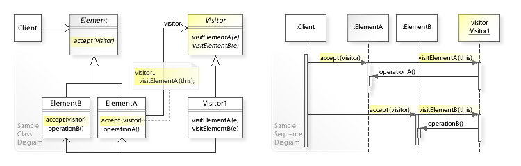
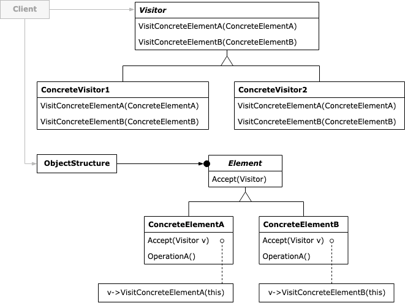

:root_path: ../../..
:docs_path: ..
:src_path: ../../src/net/razy/design/patterns/behavioral/visitor
include::{root_path}/adocs/_toc.adoc[]

= Visitor Pattern

== Descriptions
알고리즘을 객체 구조에서 분리시키는 디자인 패턴이다.

이렇게 분리를 하면 구조를 수정하지 않고도 실질적으로 새로운 동작을 기존의 객체 구조에 추가할 수 있게 된다

include::{root_path}/adocs/_to_index.adoc[]

== UML

include::{root_path}/adocs/_to_index.adoc[]

== Code Examples
=== Elements
.Element
[source,java]
----
include::{src_path}/Element.java[]
----

.Sensor
[source,java]
----
include::{src_path}/Sensor.java[]
----

.Wheel
[source,java]
----
include::{src_path}/Wheel.java[]
----

.Engine
[source,java]
----
include::{src_path}/Engine.java[]
----

=== ObjectStructure
.Motorcycle
[source,java]
----
include::{src_path}/Motorcycle.java[]
----

=== Visitor
.Visitor
[source,java]
----
include::{src_path}/Visitor.java[]
----

.ReportVisitor
[source,java]
----
include::{src_path}/ReportVisitor.java[]
----

.RepairVisitor
[source,java]
----
include::{src_path}/RepairVisitor.java[]
----

=== Client
.Client
[source,java]
----
include::{src_path}/Client.java[]
----

=== Results
----
ReportVisitor
	- Sensor OK
	- Wheel OK
	- Engine OK

RepairVisitor
	- Sensor Fixed
	- Wheel Upgrade
	- Engine Tune
----

include::{root_path}/adocs/_to_index.adoc[]