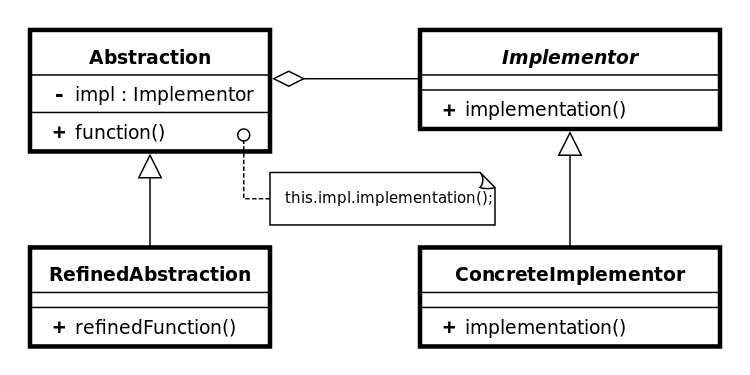

:root_path: ../..
:src_path: ../src/net/razy/design/patterns/structural/bridge
include::{root_path}/adocs/_toc.adoc[]

= Bridge Pattern

== Descriptions
구현부에서 추상층을 분리하여 각자 독립적으로 변형이 가능하고 확장이 가능하도록 한다.

* 즉 기능 클래스 계층과 구현 클래스 계층으로 구현을 하는 패턴.
* 전형적인 상속을 이용한 패턴으로 확장 설계에 용이.

include::{root_path}/adocs/_to_index.adoc[]

== UML

include::{root_path}/adocs/_to_index.adoc[]

== Code Examples
=== Abstraction Classes
==== AbstractAbstraction
기능부의 기능(interface) 정의 Class

.AbstractAbstraction
[source,java]
----
include::{src_path}/AbstractAbstraction.java[]
----

==== EagleAbstraction
기능부의 기능 구체화/확장 Class

.EagleAbstraction
[source,java]
----
include::{src_path}/EagleAbstraction.java[]
----

==== WolfAbstraction
기능부의 기능 구체화/확장 Class

.WolfAbstraction
[source,java]
----
include::{src_path}/WolfAbstraction.java[]
----

=== Implementor
기능부의 실제 기능 구현을 담당.

==== MammalImplementor
포유류의 기능(동작)을 정의

.MammalImplementor
[source,java]
----
include::{src_path}/MammalImplementor.java[]
----

==== BirdImplementor
조류의 기능(동작)을 정의

.BirdImplementor
[source,java]
----
include::{src_path}/BirdImplementor.java[]
----

=== Client
.Client
[source,java]
----
include::{src_path}/Client.java[]
----

=== Results
----
독수리는 끼룩 끼룩
	- 조류는 날아간다.
	- 조류는 낙아챈다.

늑대는 워우~~~
	- 포유류는 기어간다.
	- 포유류는 물어뜯는다.
----

include::{root_path}/adocs/_to_index.adoc[]