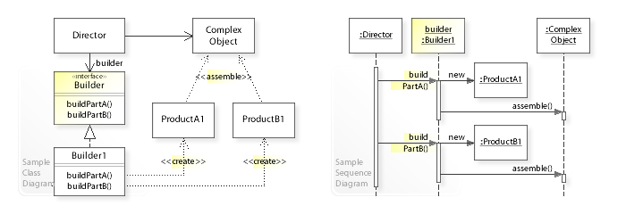

:root_path: ../..
:src_path: ../src/net/razy/design/patterns/creational/builder
include::{root_path}/adocs/_toc.adoc[]

= Builder Pattern

== Descriptions
*객체의 생성 알고리즘과 조립 방법을 분리*

복잡한 객체를 생성하는 방법과 표현하는 방법을 정의하는 클래스를 별도로 분리하여
서로 다른 표현이라도 이를 생성할 수 있는 동일한 구축 공정을 제공할 수 있도록 한다.

ref> link:https://projectlombok.org/features/Builder[Lombok @Builder]

include::{root_path}/adocs/_to_index.adoc[]

== UML

image::builder-02.png[align=center]

include::{root_path}/adocs/_to_index.adoc[]

== Code Examples
* Builder 구현 방법에는 `setter`, `Method Chaining pattern` 등 여러가지 구현 방법이 있다.
* 중요한 것은 구축(Build) 방법이 구죽 대상(Product)과 분리 된다는 점이다.
** 빌더 클래스를 꼭 객체를 만들어낼 클래스와 분리할 필요는 없다.
* link:https://ko.wikipedia.org/wiki/%EB%B9%8C%EB%8D%94_%ED%8C%A8%ED%84%B4#%EC%9E%90%EB%B0%94[Wikipdia]
에서는 Director 를 구현 하도록 되어 있으나 Builder Pattern 의 필수 요소는 아니다.

=== Method Chaining Pattern Example
==== Product
.Product
[source,java]
----
include::{src_path}/Product.java[]
----

==== Builder
.Builder
[source,java]
----
include::{src_path}/ProductBuilder.java[]
----

=== Setter & Director Example
==== Product
.Product
[source,java]
----
include::{src_path}/Product.java[]
----

==== Builder
.AbstractBuilder
[source,java]
----
include::{src_path}/AbstractBuilder.java[]
----

.BlueProductBuilder
[source,java]
----
include::{src_path}/BlueProductBuilder.java[]
----

.GreenProductBuilder
[source,java]
----
include::{src_path}/GreenProductBuilder.java[]
----

==== Director
.Director
[source,java]
----
include::{src_path}/Director.java[]
----

=== Client
.Client
[source,java]
----
include::{src_path}/Client.java[]
----

=== Results
----
Made in ProductBuilder
	- Title : Sample Product
	- Color : BLACK
	- Price : 1500

Made in BlueProductBuilder
	- Title : Blue Product
	- Color : BLUE
	- Price : 1000

Made in GreenProductBuilder
	- Title : Green Product
	- Color : Green
	- Price : 1100
----
include::{root_path}/adocs/_to_index.adoc[]