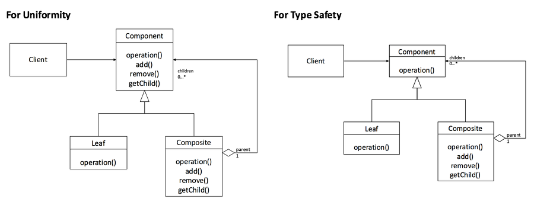

:root_dir: ../../
:docs_dir: ./
:src_dir: ../src/net/razy/design/patterns/structural/composite
include::{root_dir}/adocs/_toc.adoc[]

= Composite Pattern

== Descriptions
전체-부분 패턴, 단일 객체와 복합 객체 모두 동일하게 처리.

include::{root_dir}/adocs/_to_index.adoc[]

== UML

include::{root_dir}/adocs/_to_index.adoc[]

== Code Examples: Uniformity

=== Component
.Component
[source,java]
----
include::{src_dir}/uniformity/Component.java[]
----

=== Composite
.Composite
[source,java]
----
include::{src_dir}/uniformity/Composite.java[]
----

.Leaf
[source,java]
----
include::{src_dir}/uniformity/Leaf.java[]
----

=== Client
.Client
[source,java]
----
include::{src_dir}/uniformity/Client.java[]
----

=== Results
----
Path =  / ROOT / Sub 1 / Sub-Sub 1 / Leaf 1
Path =  / ROOT / Sub 1 / Sub-Sub 1 / Leaf 2
Path =  / ROOT / Sub 2 / Sub-Sub 2 / Leaf 1
Path =  / ROOT / Sub 2 / Sub-Sub 2 / Leaf 2
----

include::{root_dir}/adocs/_to_index.adoc[]

== Code Examples: Type Safety

=== Component
.Component
[source,java]
----
include::{src_dir}/type_safety/Component.java[]
----

=== Composite
.AbstractComposite
[source,java]
----
include::{src_dir}/type_safety/AbstractComposite.java[]
----

.Composite
[source,java]
----
include::{src_dir}/type_safety/Composite.java[]
----

.Leaf
[source,java]
----
include::{src_dir}/type_safety/Leaf.java[]
----

=== Client
.Client
[source,java]
----
include::{src_dir}/type_safety/Client.java[]
----

=== Results
----
Path =  / ROOT / Sub 1 / Sub-Sub 1 / Leaf 1
Path =  / ROOT / Sub 1 / Sub-Sub 1 / Leaf 2
Path =  / ROOT / Sub 2 / Sub-Sub 2 / Leaf 1
Path =  / ROOT / Sub 2 / Sub-Sub 2 / Leaf 2
----

include::{root_dir}/adocs/_to_index.adoc[]