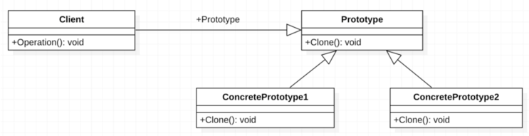

:root_path: ../../..
:docs_path: ..
:src_path: ../../src/net/razy/design/patterns/creational/prototype
include::{root_path}/adocs/_toc.adoc[]

= Prototype Pattern

== Descriptions
생성할 객체들의 타입이 프로토타입인 인스턴스로부터 결정되도록 하며,
인스턴스는 새 객체를 만들기 위해 자신을 `복제(clone)` 한다.

include::{root_path}/adocs/_to_index.adoc[]

== UML

include::{root_path}/adocs/_to_index.adoc[]

== Code Examples
=== Abstract Classes
==== Prototype
.AbstractPrototype
[source,java]
----
include::{src_path}/AbstractPrototype.java[]
----

=== Concrete Classes
==== Concrete Prototypes
.ConcreteProduct1000
[source,java]
----
include::{src_path}/ConcreteProduct1000.java[]
----

.ConcreteProduct2000
[source,java]
----
include::{src_path}/ConcreteProduct2000.java[]
----

=== Client
.Client
[source,java]
----
include::{src_path}/Client.java[]
----

=== Results
----
Create Products Type A

 Product
	- Title : Product A
	- Price : 1000

 Product
	- Title : Product A
	- Price : 1000

 Product
	- Title : Product A
	- Price : 1000

Create Products Type B

 Product
	- Title : Product B
	- Price : 2000

 Product
	- Title : Product B
	- Price : 2000

 Product
	- Title : Product B
	- Price : 2000
----

include::{root_path}/adocs/_to_index.adoc[]

