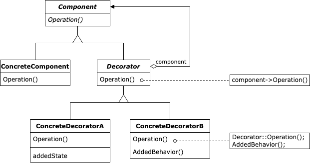

:root_dir: ../../
:docs_dir: ./
:src_dir: ../src/net/razy/design/patterns/structural/decorator
include::{root_dir}/adocs/_toc.adoc[]

= Decorator Pattern

== Descriptions

include::{root_dir}/adocs/_to_index.adoc[]

== UML

include::{root_dir}/adocs/_to_index.adoc[]

== Code Examples

=== Component
.Component
[source,java]
----
include::{src_dir}/Component.java[]
----

=== Decorator
.AbstractDecorator
[source,java]
----
include::{src_dir}/AbstractDecorator.java[]
----

.ConcreteDecoratorA
[source,java]
----
include::{src_dir}/ConcreteDecoratorA.java[]
----

.ConcreteDecoratorB
[source,java]
----
include::{src_dir}/ConcreteDecoratorB.java[]
----

=== Client
.Client
[source,java]
----
include::{src_dir}/Client.java[]
----

=== Results
----
Component
	 add decoration A
	 add decoration B
----

include::{root_dir}/adocs/_to_index.adoc[]