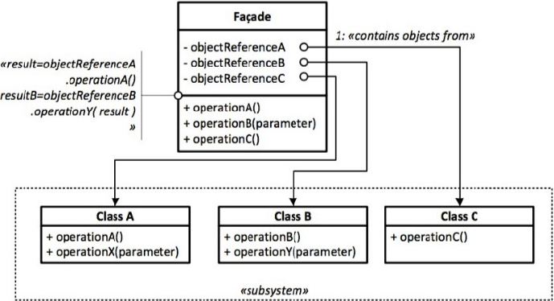

:root_path: ../..
:src_path: ../src/net/razy/design/patterns/structural/facade
include::{root_path}/adocs/_toc.adoc[]

= Facade Pattern

== Descriptions
클래스 라이브러리 같은 어떤 소프트웨어의 다른 커다란 코드 부분에 대한 간략화된 인터페이스를 제공하는 객체이다.

* 퍼사드 객체는 복잡한 소프트웨어 바깥쪽의 코드가 라이브러리의 안쪽 코드에 의존하는 일을 감소시켜 주고,
* 복잡한 소프트웨어 및 절차를 사용 할 수 있게 간단한 인터페이스를 제공해줍니다.

include::{root_path}/adocs/_to_index.adoc[]

== UML

include::{root_path}/adocs/_to_index.adoc[]

== Code Examples

=== Library/Component
.Amp
[source,java]
----
include::{src_path}/Amp.java[]
----

.CDPlayer
[source,java]
----
include::{src_path}/CDPlayer.java[]
----

.Projector
[source,java]
----
include::{src_path}/Projector.java[]
----

=== Facade

.TheaterFacade
[source,java]
----
include::{src_path}/TheaterFacade.java[]
----

=== Client
.Client
[source,java]
----
include::{src_path}/Client.java[]
----

=== Results
----
Theater Play
	- Amp On
	- Project On
	- Project set wide screen mode
	- CDPlayer On
	- CDPlayer Play

Theater Stop
	- CDPlayer Stopped
----

include::{root_path}/adocs/_to_index.adoc[]