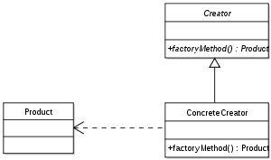

:root_path: ../..
:src_path: ../src/net/razy/design/patterns/creational/factory_method
include::{root_path}/adocs/_toc.adoc[]

= Factory Method Pattern

== Descriptions
객체를 생성하기 위해 인터페이스를 정의하지만,
어떤 클래스의 인스턴스를 생성할지에 대한 결정은 서브클래스가 내리도록 합니다.

include::{root_path}/adocs/_to_index.adoc[]

== UML

include::{root_path}/adocs/_to_index.adoc[]

== Code Examples
=== Abstract Classes
==== Creator
.AbstractCreator
[source,java]
----
include::{src_path}/AbstractCreator.java[]
----

==== Product
.AbstractProduct
[source,java]
----
include::{src_path}/AbstractProduct.java[]
----

=== Concrete Classes
==== Creator
.ConcreteCreator
[source,java]
----
include::{src_path}/ConcreteCreator.java[]
----

==== Products
.ConcreteProduct
[source,java]
----
include::{src_path}/ConcreteProduct.java[]
----

.ConcreteProductA
[source,java]
----
include::{src_path}/ConcreteProductA.java[]
----

.ConcreteProductB
[source,java]
----
include::{src_path}/ConcreteProductB.java[]
----

=== Client
.Client
[source,java]
----
include::{src_path}/Client.java[]
----

=== Results
----
Product
	- Title : Default Product
	- Price : 1000

 Product
	- Title : Type A Product
	- Price : 1100

 Product
	- Title : Type B Product
	- Price : 1500
----
include::{root_path}/adocs/_to_index.adoc[]
