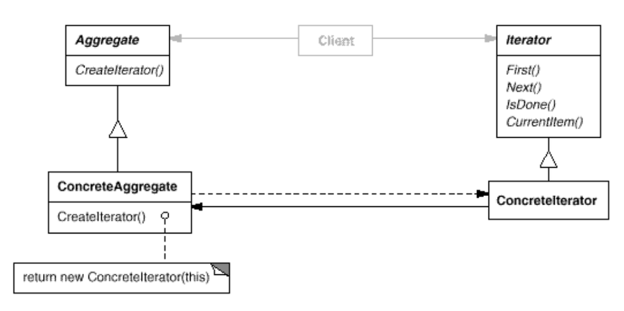

:root_dir: ../../
:docs_dir: ./
:src_dir: ../src/net/razy/design/patterns/behavioral/iterator
include::{root_dir}/adocs/_toc.adoc[]

= Iterator Pattern

== Descriptions

include::{root_dir}/adocs/_to_index.adoc[]

== UML

image::iterator-02.jpeg[align=center]

include::{root_dir}/adocs/_to_index.adoc[]

== Code Examples
=== Iterator
.Iterator
[source,java]
----
include::{src_dir}/Iterator.java[]
----

.ListIterator
[source,java]
----
include::{src_dir}/ListIterator.java[]
----

=== Aggregate
.Aggregate
[source,java]
----
include::{src_dir}/Aggregate.java[]
----

.ConcreteAggregate
[source,java]
----
include::{src_dir}/ConcreteAggregate.java[]
----

=== Item
.Item
[source,java]
----
include::{src_dir}/Item.java[]
----

=== Client
.Client
[source,java]
----
include::{src_dir}/Client.java[]
----

=== Results
----
item 1
item 2
item 3
----

include::{root_dir}/adocs/_to_index.adoc[]