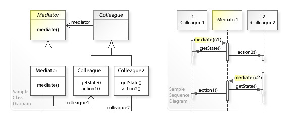

:root_dir: ../../
:docs_dir: ./
:src_dir: ../src/net/razy/design/patterns/behavioral/mediator
include::{root_dir}/adocs/_toc.adoc[]

= Mediator Pattern

== Descriptions
소프트웨어 공학에서 어떻게 객체들의 집합이 ``상호작용``하는지를 함축해놓은 객체를 정의한다.

이 패턴은 프로그램의 실행 행위를 변경할 수 있기 때문에 행위 패턴으로 간주된다.

중재자 패턴을 사용하면 객체 간 통신은 중재자 객체 안에 함축된다.
객체들은 더 이상 다른 객체와 서로 직접 통신하지 않으며 대신 중재자를 통해 통신한다.
이를 통해 통신 객체 간 의존성을 줄일 수 있으므로 결합도를 감소시킨다.

include::{root_dir}/adocs/_to_index.adoc[]

== UML
image::mediator.png[align=center]

include::{root_dir}/adocs/_to_index.adoc[]

== Code Examples

=== Client
.Client
[source,java]
----
include::{src_dir}/Client.java[]
----

=== Results
----
Red Light Turn On
	- Red Light is On
	- Green Light is Off
	- Yellow Light is Off

Green Light Turn On
	- Red Light is Off
	- Green Light is On
	- Yellow Light is Off

Yellow Light Turn On
	- Red Light is Off
	- Green Light is Off
	- Yellow Light is On
----

include::{root_dir}/adocs/_to_index.adoc[]