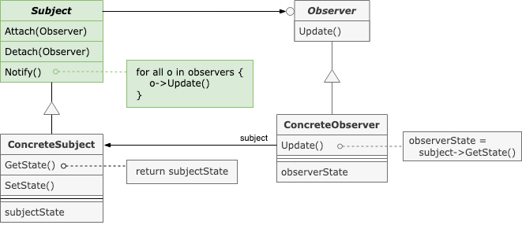

:root_path: ../..
:src_path: ../src/net/razy/design/patterns/behavioral/observer
include::{root_path}/adocs/_toc.adoc[]

= Observer Pattern

== Descriptions

include::{root_path}/adocs/_to_index.adoc[]

== UML

include::{root_path}/adocs/_to_index.adoc[]

== Code Examples
=== Subject
.Subject
[source,java]
----
include::{src_path}/Subject.java[]
----

.ConcreteSubject
[source,java]
----
include::{src_path}/ConcreteSubject.java[]
----

=== Observers
.Observer
[source,java]
----
include::{src_path}/Observer.java[]
----

.ConcreteObserverA
[source,java]
----
include::{src_path}/ConcreteObserverA.java[]
----

.ConcreteObserverB
[source,java]
----
include::{src_path}/ConcreteObserverB.java[]
----

.ConcreteObserverC
[source,java]
----
include::{src_path}/ConcreteObserverC.java[]
----

=== Client
.Client
[source,java]
----
include::{src_path}/Client.java[]
----

=== Results
----
Set Subject State = State 1
	-ConcreteObserverA Update by State 1
	-ConcreteObserverC Update by State 1
	-ConcreteObserverB Update by State 1

Set Subject State = State 2
	-ConcreteObserverA Update by State 2
	-ConcreteObserverC Update by State 2
	-ConcreteObserverB Update by State 2

Set Subject State = State 3
	-ConcreteObserverA Update by State 3
	-ConcreteObserverC Update by State 3
	-ConcreteObserverB Update by State 3
----

include::{root_path}/adocs/_to_index.adoc[]