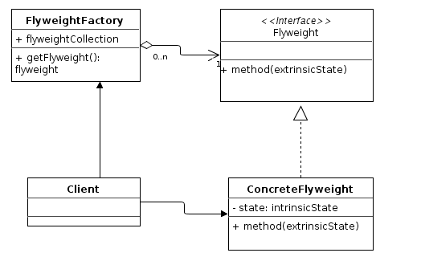

:root_path: ../../..
:docs_path: ..
:src_path: ../../src/net/razy/design/patterns/structural/flyweight
include::{root_path}/adocs/_toc.adoc[]

= Flyweight Pattern

== Descriptions
많은 수의 객체를 효율적으로 제공하기위해 공유개념을 이용한다.

동일하거나 유사한 객체들 사이에 가능한 많은 데이터를 서로 공유하여 사용하도록 하여 메모리 사용량을 최소화하는 소프트웨어 디자인 패턴이다.
종종 오브젝트의 일부 상태 정보는 공유될 수 있는데, 플라이웨이트 패턴에서는 이와 같은 상태 정보를 외부 자료 구조에 저장하여 플라이웨이트 오브젝트가 잠깐 동안 사용할 수 있도록 전달한다.

include::{root_path}/adocs/_to_index.adoc[]

== UML

include::{root_path}/adocs/_to_index.adoc[]

== Code Examples
=== Flyweight
.Flyweight
[source,java]
----
include::{src_path}/Flyweight.java[]
----

.ConcreteFlyweight
[source,java]
----
include::{src_path}/ConcreteFlyweight.java[]
----

=== FlyweightFactory
.FlyweightFactory
[source,java]
----
include::{src_path}/FlyweightFactory.java[]
----

=== Client
.Client
[source,java]
----
include::{src_path}/Client.java[]
----

=== Results
----
Create New FLY weight       <= 동일 객체 생성은 최초 1회만 실행
	- Im a FLY weight
Create New LIGHT weight     <= 동일 객체 생성은 최초 1회만 실행
	- Im a LIGHT weight
Create New MIDDLE weight    <= 동일 객체 생성은 최초 1회만 실행
	- Im a MIDDLE weight
	- Im a MIDDLE weight
Create New HEAVY weight     <= 동일 객체 생성은 최초 1회만 실행
	- Im a HEAVY weight
	- Im a LIGHT weight
	- Im a FLY weight
----

include::{root_path}/adocs/_to_index.adoc[]